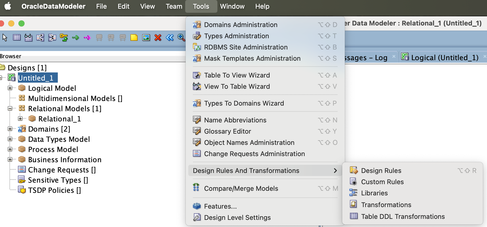
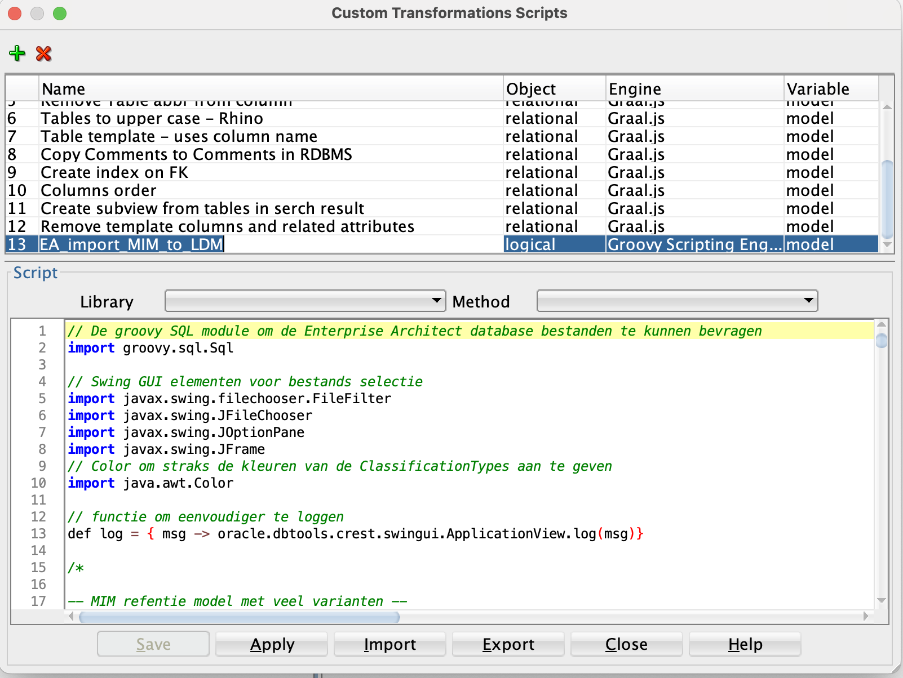

# Toevoegen script in SDDM

Open SDDM en ga naar het menu Tools -> Design Rules And Transformations -> Transformations

Voeg een nieuwe script regel toe met als:
- Object - logical
- Engine - Groovy Scripting Engine
- Variable - model

Plak daarna de Groovy code uit *transformation_scripts/logical/EA_import_MIM_to_LDM.groovy* in het script veld.

